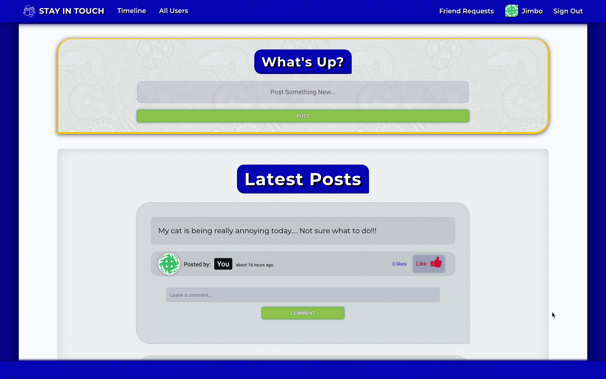
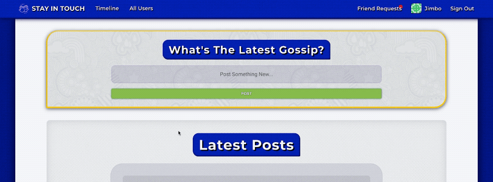
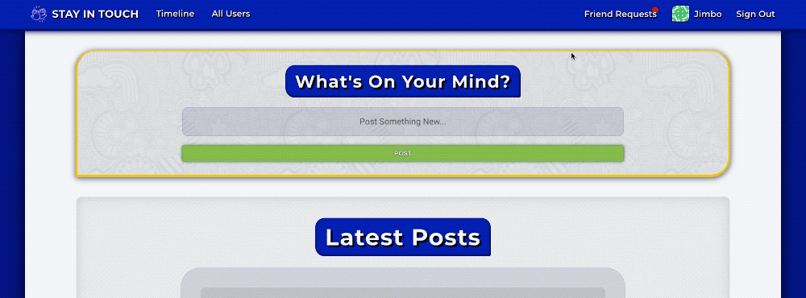
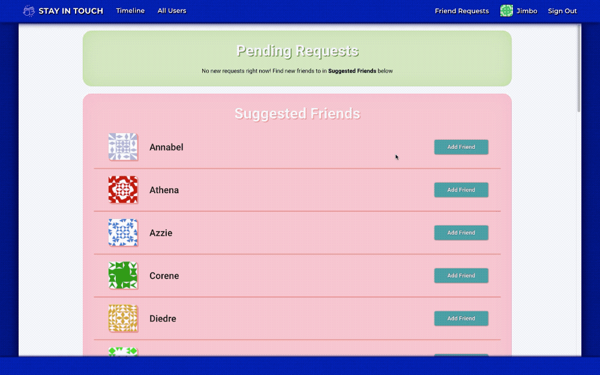
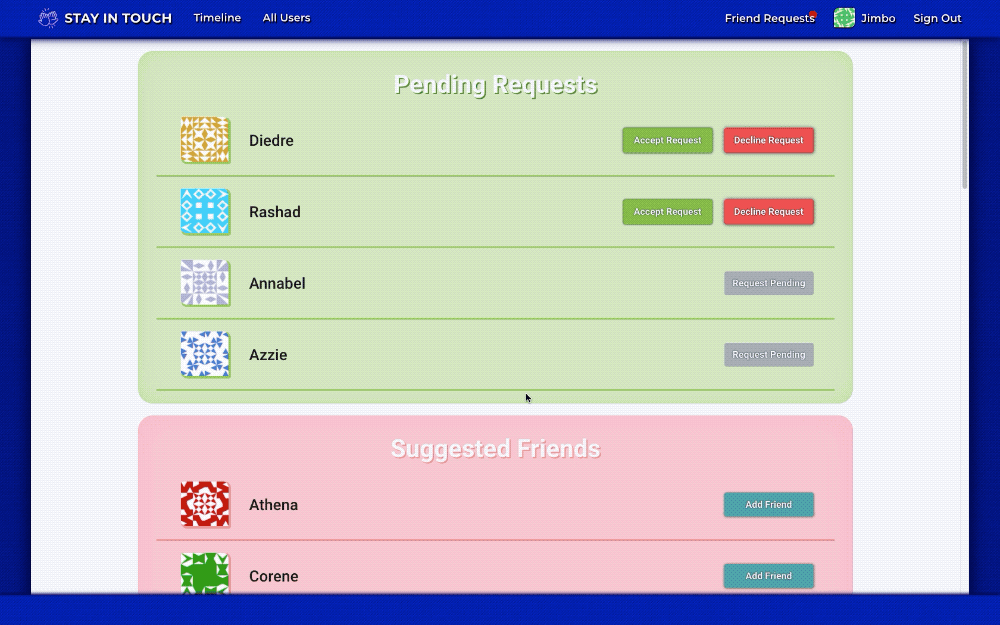

<a class="github-button" href="https://github.com/Rhelli" data-color-scheme="no-preference: light; light: light; dark: dark;" data-size="large" data-show-count="true" aria-label="Follow @Rhelli on GitHub">Follow @Rhelli</a>

<a class="github-button" href="https://github.com/Rhelli/StayInTouch-Social-Media/subscription" data-color-scheme="no-preference: light; light: light; dark: dark;" data-icon="octicon-eye" data-size="large" data-show-count="true" aria-label="Watch Rhelli/StayInTouch-Social-Media on GitHub">Watch</a>

<a class="github-button" href="https://github.com/Rhelli/StayInTouch-Social-Media" data-color-scheme="no-preference: light; light: light; dark: dark;" data-icon="octicon-star" data-size="large" data-show-count="true" aria-label="Star Rhelli/StayInTouch-Social-Media on GitHub">Star</a>

<a class="github-button" href="https://github.com/Rhelli/StayInTouch-Social-Media/issues" data-color-scheme="no-preference: light; light: light; dark: dark;" data-icon="octicon-issue-opened" data-size="large" data-show-count="true" aria-label="Issue Rhelli/StayInTouch-Social-Media on GitHub">Issue<a>

<a class="github-button" href="https://github.com/Rhelli/StayInTouch-Social-Media/fork" data-color-scheme="no-preference: light; light: light; dark: dark;" data-icon="octicon-repo-forked" data-size="large" data-show-count="true" aria-label="Fork Rhelli/StayInTouch-Social-Media on GitHub">Fork</a>

  

  <h1 align="center"> ☝🏽 Stay In Touch</h1>

<h3 align='center'>  
    A Social Media Web App Built With Rails.
</h3>

     
    <a href="https://murmuring-scrubland-45037.herokuapp.com/"><strong>Visit The Site »</strong></a>
     
     
    <a href="https://github.com/Rhelli/StayInTouch-Social-Media/archive/develop.zip">Download this repository</a>
    |
    <a href="https://github.com/Rhelli/StayInTouch-Social-Media/issues/new/choose">Report A Bug</a>
    |
    <a href="https://github.com/Rhelli/StayInTouch-Social-Media/fork">Fork It</a>
  

## Table of Contents
  - [The Project Brief](https://github.com/Rhelli/StayInTouch-Social-Media/tree/release/0.1.0#-the-project-brief)
  - [The Nitty Gritty](https://github.com/Rhelli/StayInTouch-Social-Media/tree/release/0.1.0#-the-nitty-gritty)
  - [Tools & Technology Used](https://github.com/Rhelli/StayInTouch-Social-Media/tree/release/0.1.0#-tools--technology-used)
  - [Setup & Use](https://github.com/Rhelli/StayInTouch-Social-Media/tree/release/0.1.0#-setup--use)
  - [Showcase](https://github.com/Rhelli/StayInTouch-Social-Media/tree/release/0.1.0#%EF%B8%8F-showcase)
  - [Contributions, Issues and Forking](https://github.com/Rhelli/StayInTouch-Social-Media/tree/release/0.1.0#-contributions-issues-and-forking)
  - [Creator](https://github.com/Rhelli/StayInTouch-Social-Media/tree/release/0.1.0#-creator)
  - [Show Your Support!](https://github.com/Rhelli/StayInTouch-Social-Media/tree/release/0.1.0#-show-your-support)
  - [Licensing](https://github.com/Rhelli/StayInTouch-Social-Media/tree/release/0.1.0#%EF%B8%8F-licensing)

## 🔰 The Project Brief

This is a project included in the Rails module to be completed by students of [Microverse](https://www.microverse.org/).

This project sees us tackle a larger, more complex and realistic task in creating a social media web app with all the functionality we've come to expect from social media websites - friendships, invites, posts, comments and likes.

As this project naturally has a larger remit than previous back-end centric projects that have come before, it is split up into <u>5 major milestones</u>:
 1. Data Architecture & Planning
 2. Creation of friendship models & associations
 3. Improving efficiency of mutual friendship generation & handling
 4. Deployment to Heroku
 5. Final Touches & Styling

## 🔍 The Nitty Gritty
Posts, comments and likes had been handled for us in the project setup, thus the core challenges in this project were establishing an efficient friendship system whereby users could send invitations as well as receive invitations, all while maintaining a tidy database.

This enforced some ground rules as to how we should generated our models:
 - Users would have to have friendships as well as inverse friendships (where they are the friend of another)
 - Friendships would have to belong to users both as the creator of the friend request and also the receiver.

Subsequently, an additional medley of controller and helper functions would enable detection of friend request states and existence, enable creation and destruction of requests and allow for updating on friend request acceptance or decline.

## 🔬 Tools & Technology Used
**Languages & Frameworks**
 - Ruby 2.7.1
 - Ruby on Rails 6.0.3.1
 - SASS/CSS3

**Gems of note**
 - [Devise](https://github.com/heartcombo/devise)
 - [Faker](https://github.com/faker-ruby/faker)
 - [HIRB](https://github.com/cldwalker/hirb)  (MVP Award 🥇)

**Testing**
 - [RSpec 3.9](https://rspec.info/)

**Database**
 - PostgreSQL

**Linters & Quality Control**
 - [Stickler CI](https://stickler-ci.com/)
 - [Rubocop 0.85.0](https://github.com/rubocop-hq/rubocop-rails)

**Deployment**
 - Heroku

### 💻 Setup & Use

#### Setup
Setup should be fairly straightforward. You will have to ensure your machine is properly equipped to run the code first:
  1. Make sure you have both [Ruby](https://www.ruby-lang.org/en/documentation/installation/) and Ruby on Rails ([Mac](https://gorails.com/setup/osx/10.15-catalina) • [Linux](https://gorails.com/setup/ubuntu/19.10) • [Windows](https://gorails.com/setup/windows/10)) installed.
  2. Download this repository.
  3. **`cd`** into the root directory of wherever you download this repo. [What does 'cd' mean?](https://www.macworld.com/article/2042378/master-the-command-line-navigating-files-and-folders.html)
  4. Whilst at the root (home) directory of this project, enter **`bundle install`** to install the projects software dependencies.
  5. In your terminal window, enter **`rails server`** to start the server.
  6. Now navigate to **`localhost:4000`** in your browser to start playing around with the webpages!

Alternatively if you'd like to confirm the entire project is passing testing:
  1. **`cd`** into this repository in your terminal
  2. Enter **`bundle exec rspec`** to run all tests

******

## 🎞️ Showcase

### Authentication & Signing In

> Signing In is facilitated with the Devise Gem and offers additional functionality like password recovery and signing up for a new account.

### The Navbar & Friend Requests Dropdown Menu

> A closer look at the site-wide navbar and Facebook-style dynamically populated friend requests dropdown.

### Viewing Friend Requests From The Navbar

> A closer look at the friend request dropdown - A notification ball displays when the user receives new friend requests and the list displays new requests. The user is given the option to accept or decline. Additionally, suggested (non-friended) users are listed below.

### Creating A New Post

> From the homepage the user can create new posts which are fed into the user and user's respective friends' timelines upon submission.

### Prompting and Encouraging Users To Post

> The post title relays a series of different messages to the user to engage and encourage the user to post more.

### Liking & Commenting On Posts

> Users are able to easily create a basic thread beneath the post's main content and like or unlike a post.

### The Friendships Page

> Selecting 'Friend Requests' from the navbar takes the user to the Friendships page, where a full page view of new invites and suggested users can be seen.

### Adding Friends From The Friendship Page

> Users can easily send friend requests from the list of suggested users. New pending friend requests appear at the top of the page.

### Accepting & Declining Requests From The Friendship Page

> Incoming friend requests will also appear at the top of the page, prior to 'Pending Requests'. Accepting will add the sender of the invitation to the users friends. Declining will delete the friendship (and friend request by extension).

### The User Index

> As an alternative to the Friendship page, the User Index will display all users - friends, non-friends and pending requests.

### The User Profile

> The user profile displays the users own posts and offers familiar functionality such as commenting on and liking their posts.

### Friend Requests & Status From The User Profile

> The user profile also features 'Add Friend', 'Request Pending' and 'Friends' buttons.

*******

## 🚦 Contributions, Issues and Forking

Contributions, issues and feature requests are more than welcome! 

If you have any problems running or setting up Gitshoes, please submit it as a bug on the [issues page.](https://github.com/Rhelli/StayInTouch-Social-Media/issues) right away!

If you want to make your own changes, modifications or improvements, go ahead and Fork it!
1. [Fork it](https://github.com/Rhelli/StayInTouch-Social-Media/fork)
2. Create your working branch (git checkout -b [choose-a-name])
3. Commit your changes (git commit -am 'what this commit will fix/add/improve')
4. Push to the branch (git push origin [chosen-name])
5. Create a new Pull Request

## 👨🏽‍💻 Creator

Rory Hellier - [Github](https://github.com/Rhelli)

## 🖐🏼 Show Your Support!
Give a ⭐️ if you like this project!

## ⚖️ Licensing
This project is [MIT](https://github.com/Rhelli/StayInTouch-Social-Media/LICENSE.txt) licensed.

